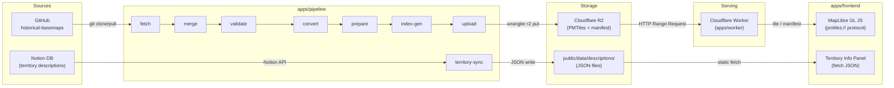

# データフロー

> Last synced: 2026-03-08

## 概要

外部データソース（GitHub / Notion）からパイプラインで中間処理し、Cloudflare R2 経由または静的ファイルとしてフロントエンドに配信する。地図タイルと領土説明の 2 系統がある。

## 全体フロー

## 境界と変換ポイント

### 地図タイル系統

| 境界 | 入力形式 | 出力形式 | 手段 |
|------|---------|---------|------|
| GitHub → fetch | Git リポジトリ | `world_{year}.geojson` (生 GeoJSON) | git clone --depth 1 |
| fetch → merge | 生 GeoJSON (個別 Feature) | `world_{year}_merged.geojson` + `_labels.geojson` | @turf/turf で同名領土を MultiPolygon に統合、ラベル点を生成 |
| merge → validate | merged GeoJSON | ValidationResult (pass/fail) | GeoJSON スキーマ検証 |
| validate → convert | merged GeoJSON + labels GeoJSON | `world_{year}.pmtiles` | tippecanoe (territories/labels レイヤー) + tile-join |
| convert → prepare | PMTiles | `world_{year}.{hash8}.pmtiles` | SHA-256 ハッシュ付きファイル名にコピー |
| prepare → upload | ハッシュ付き PMTiles + manifest.json | R2 オブジェクト | wrangler r2 object put |
| R2 → Worker → Frontend | R2 オブジェクト | HTTP レスポンス (Range Request 対応) | Worker が R2 バインディングで読み取り、Cache API でキャッシュ |
| Worker → MapLibre | HTTP (pmtiles://) | ベクタータイル描画 | pmtiles プロトコルで MapLibre が Range Request |

### 領土説明系統

| 境界 | 入力形式 | 出力形式 | 手段 |
|------|---------|---------|------|
| Notion → territory-sync | Notion Page (properties) | TransformedEntry | Notion API (dataSources.query) |
| territory-sync → JSON | TransformedEntry[] | `{year}.json` (YearDescriptionBundle) | 年ごとにグルーピングして JSON 書き出し |
| JSON → Frontend | 静的 JSON ファイル | TerritoryDescription | fetch(`/data/descriptions/{year}.json`) |

### 補助: index-gen

パイプライン完了時に `public/pmtiles/index.json` を生成。フロントエンドは初期化時にこれを fetch し、利用可能な年代一覧と各年の領土名リストを取得する。
