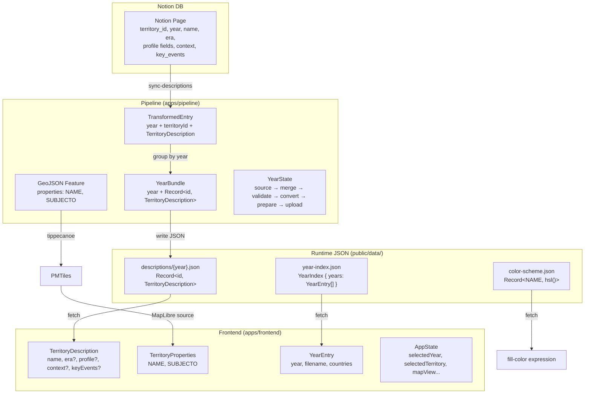

# データモデル

> Last synced: 2026-03-08

## 概要

世界史地図アプリのドメインモデル。Territory（勢力圏）と Year（年代）を中核とし、pipeline → frontend 間で同一形状の型が独立定義されている。

## 型の関連と変換チェーン



## 中核型定義

### TerritoryDescription（frontend / pipeline 両方に同一形状で存在）

```typescript
interface TerritoryDescription {
  name: string;
  era?: string;
  profile?: TerritoryProfile;
  context?: string;
  keyEvents?: KeyEvent[];
}

interface TerritoryProfile {
  capital?: string;
  regime?: string;
  dynasty?: string;
  leader?: string;
  religion?: string;
}

interface KeyEvent {
  year: number;
  event: string;
}
```

### TerritoryProperties（GeoJSON / PMTiles レイヤーの属性）

```typescript
interface TerritoryProperties {
  NAME: string;
  SUBJECTO: string;
}
```

### YearEntry（frontend / pipeline 同一定義）

```typescript
interface YearEntry {
  year: number;
  filename: string;
  countries: string[];
}
```

## 境界と変換ポイント

| 境界 | 変換元 | 変換先 | 方法 |
|------|--------|--------|------|
| Notion → Pipeline | Notion Page properties | TransformedEntry | `@notionhq/client` API |
| Pipeline → JSON | YearBundle | `descriptions/{year}.json` | `writeFileSync` |
| Pipeline → PMTiles | GeoJSON FeatureCollection | `.pmtiles` | tippecanoe CLI |
| JSON → Frontend | `descriptions/{year}.json` | `YearDescriptionBundle` | `fetch` + JSON parse |
| PMTiles → Frontend | PMTiles vector tile | `TerritoryProperties` | MapLibre GL JS source |

## 型の重複

`TerritoryDescription` 系と `YearEntry` は pipeline / frontend 間で共有パッケージを持たず、各アプリに独立定義されている。JSON ファイルがスキーマの事実上の契約として機能し、pipeline 側は Zod スキーマ（`validate-descriptions.ts`）でバリデーションしている。
