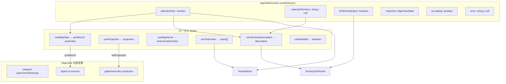
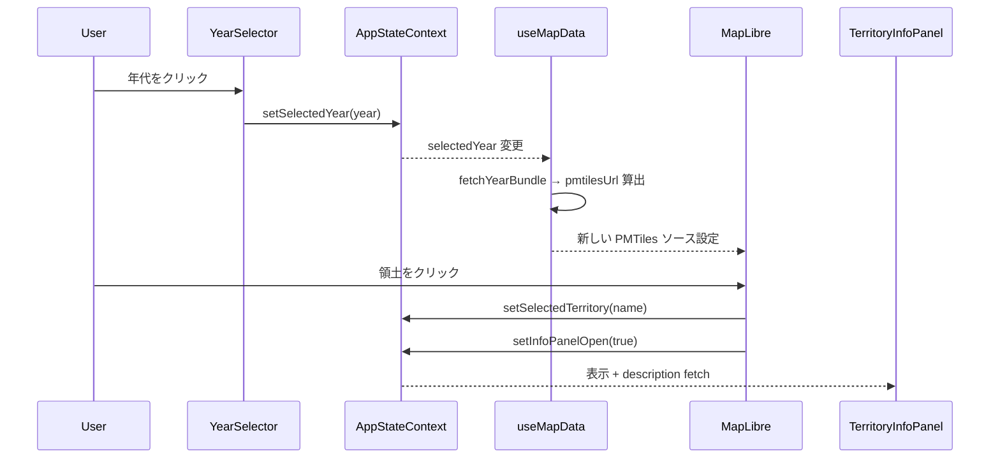

# フロントエンド状態設計

> Last synced: 2026-03-08

## 概要

フロントエンドの状態管理は 3 層に分かれる: AppStateContext（グローバル共有状態）、ローカル hooks（コンポーネント固有状態）、MapLibre 内部状態（地図エンジン管理）。URL パラメータは未使用。

## 状態の流れ

## 主要ユーザー操作フロー

## 境界と同期ポイント

| 境界 | 方向 | 仕組み |
|------|------|--------|
| AppStateContext ↔ MapView | 双方向 | Context の selectedYear が useMapData を駆動。地図クリックが Context を更新 |
| AppStateContext ↔ TerritoryInfoPanel | 単方向 | Context の selectedTerritory + selectedYear → useTerritoryDescription で JSON fetch |
| useProjection ↔ MapLibre | 単方向 | hook が mapRef 経由で setProjection / flyTo を直接呼び出し |
| useTerritoryDescription ↔ ネットワーク | 単方向 | モジュールレベル Map キャッシュ + prefetch (`/data/descriptions/{year}.json`) |
| useIsMobile ↔ TerritoryInfoPanel | 単方向 | matchMedia でレスポンシブ分岐（BottomSheet vs サイドパネル） |
